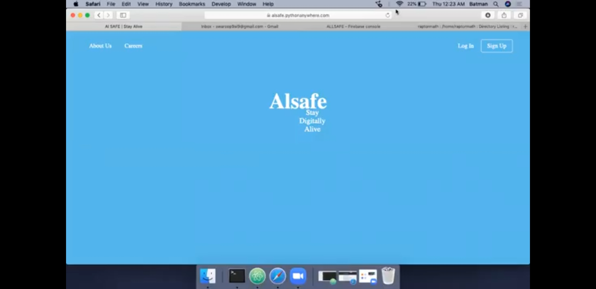
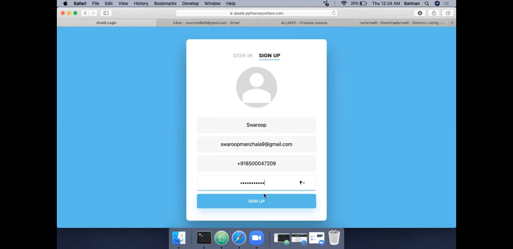
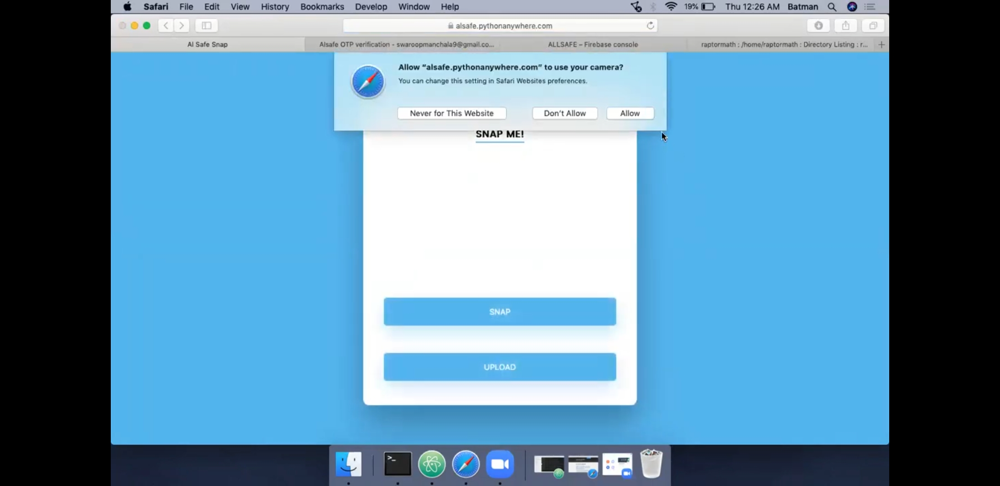
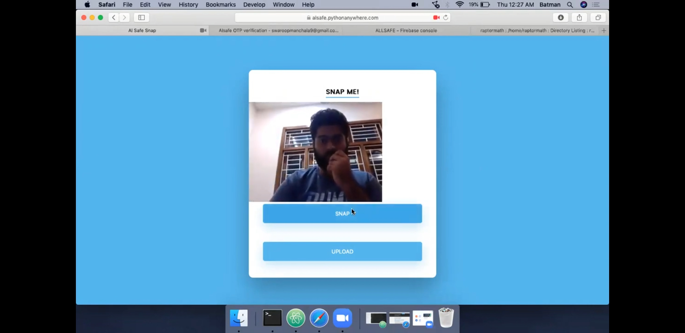
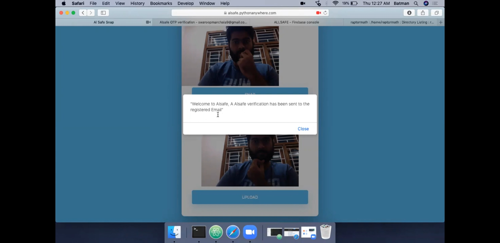
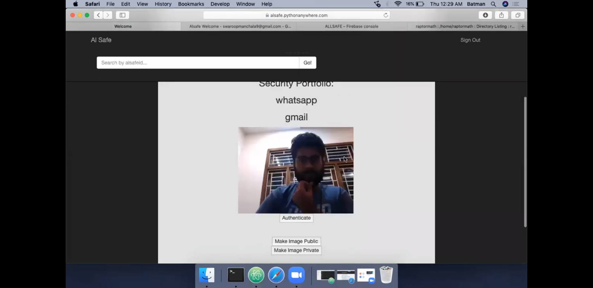

# ALsafe

We strive to protect your digital footprint and provide only one alsafe identity for a person. 

We implemented the project using Flask web development framework, using Firebase as an unstructured cloud database. Our application ensures only unique identity users to enter the application, I achieved this using Siamese Neural Network. 

Below are the Screenshots of application's beta prototype at link (https://alsafe.pythonanywhere.com)

